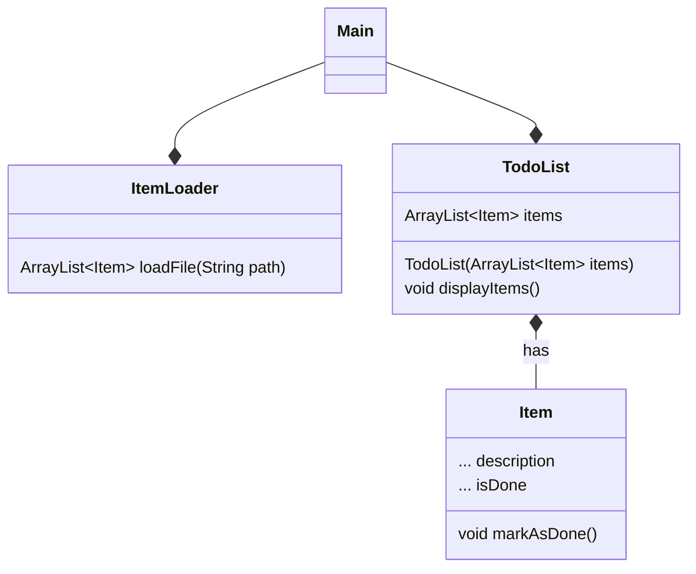

# 1st Semester Exam Assignment - Datamatiker (Computer Science)

## Overview

This repository contains one of five programming assignments that formed the basis of the 1st semester examination in the Datamatiker (Computer Science) program.

All five assignments were handed out in advance and prepared independently. On the day of the exam, a single assignment was drawn at random and formed the basis of the oral examination.

The examination consisted of:
- Code walkthrough and explanation
- Technical questions
- Minor code adjustments and problem solving during the examination

This repository represents the solution as it existed at the time of the exam.

---

## Educational Context

- **Program:** Datamatiker (Computer Science, Academy Profession Degree)
- **Semester:** 1st semester
- **Institution:** Cphbusiness (EK – Erhvervsakademi København, as of mid-2025)
- **Exam Type:** Individual practical programming exam with oral presentation
- **Language:** Java (object-oriented)

- **Completed:** Summer 2025, without the use of AI tools

---

## Experience Level at the Time

At the time this assignment was developed:
- I had been programming for under six months
- I had no prior programming experience before starting the Datamatiker program

The focus of the work was on:
- Fundamental programming concepts
- Problem solving
- Code structure and readability
- Demonstrating understanding under examination conditions

The code has been left unchanged to reflect the level and approach at that point in time.

---

## Class Diagram



---

## Assignment Description

### Dansk (original)

**to-do liste**

I denne opgave skal du loade en to-do liste, dvs. en liste af opgaver (items), som skal repræsenteres i dit program som objekter. Opgaverne skal vises til brugeren når programmet starter.

1. Lav en csv fil med opgaver (items). Hver opgave skal stå på sin egen linje. Gem filen som "todo.csv". Headeren skal have formen: `Description, Done`
2. Lav en klasse `Item` som repræsenterer en opgave i to-do listen.
   - Tilføj attributterne jvf klassediagrammet. Bestem selv datatype og access modifyer for attributterne.
   - Giv klassen metoden `markAsDone()`, som registrerer at en opgave er udført.
3. Lav en `ItemLoader` klasse
   - Tilføj metoden `loadFile()`, og lad den læse linjerne i filen. For hver linje laves et Item objekt og til sidst regturneres en ArrayList med alle Item-objekterne.
4. Lav en `TodoList` klasse
   - tilføj attributten items, og en konstruktor jvf. klassediagrammet.
   - tilføj en metode `displayItems()` i TodoList, der printer alle items i listen ud.
5. Lav en `Main` klasse med en main-metode.
   - I main-metoden skal du instantiere ItemLoader
   - På itemLoader instansen skal du kalde `loadFile`. (Send stien til csv-filen med som argument)
   - Sørg for at gemme listen, der bliver returneret fra metoden i en variabel.
   - Instantier ToDoList med listen af Item-objekter som argument.
   - Kald `displayItems` metoden i ToDoList, så du får printet alle opgaverne ud:
   
   *Eksempel output:*
     ```
     1. Gøre rent i køkkenet, done
     2. Smøre madpakker, not done
     3. Vande blomster, not done
     4. Købe ind, done
     ```

---

### English (translation)

**To-Do List**

In this assignment you must load a to-do list — that is, a list of tasks (items) — which should be represented as objects in your program. The tasks should be displayed to the user when the program starts.

1. Create a CSV file containing tasks (items). Each task must be on its own line. Save the file as `todo.csv`. The header must have the form: `Description, Done`
2. Create an `Item` class that represents a task in the to-do list.
   - Add the attributes as shown in the class diagram. Determine the data types and access modifiers yourself.
   - Give the class a `markAsDone()` method that registers a task as completed.
3. Create an `ItemLoader` class.
   - Add a `loadFile()` method, and have it read the lines in the file. For each line, create an `Item` object, and finally return an `ArrayList` containing all the `Item` objects.
4. Create a `TodoList` class.
   - Add the `items` attribute and a constructor as shown in the class diagram.
   - Add a `displayItems()` method in `TodoList` that prints all items in the list.
5. Create a `Main` class with a main method.
   - In the main method, instantiate `ItemLoader`.
   - On the `itemLoader` instance, call `loadFile` (pass the path to the CSV file as an argument).
   - Store the returned list in a variable.
   - Instantiate `ToDoList` with the list of `Item` objects as an argument.
   - Call `displayItems` on the `ToDoList` to print all tasks:
   
   *Example output:*
     ```
     1. Gøre rent i køkkenet, done
     2. Smøre madpakker, not done
     3. Vande blomster, not done
     4. Købe ind, done
     ```

---

## License

This project is licensed under the MIT License – see the [LICENSE](./LICENSE) file for details.
